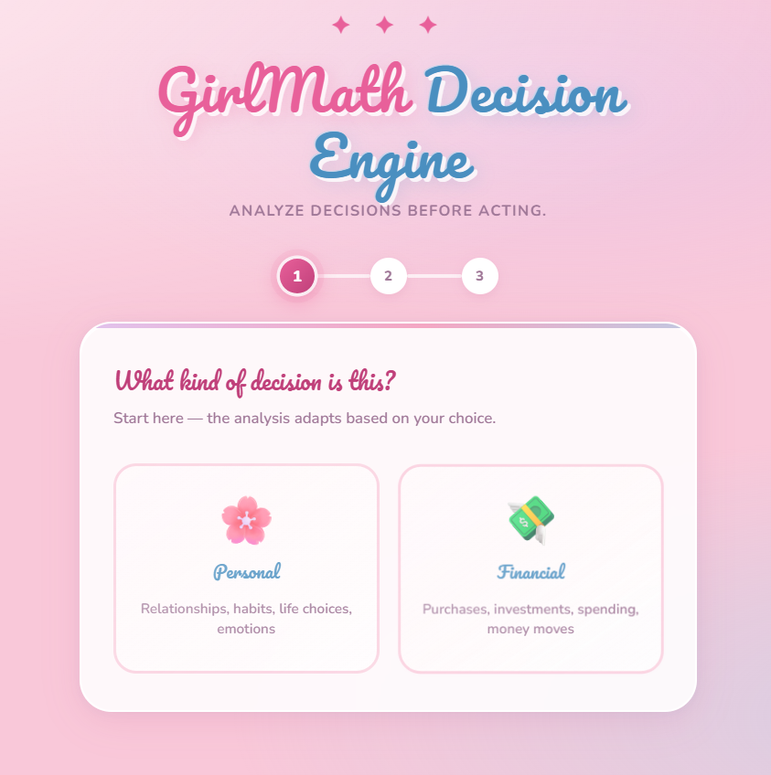
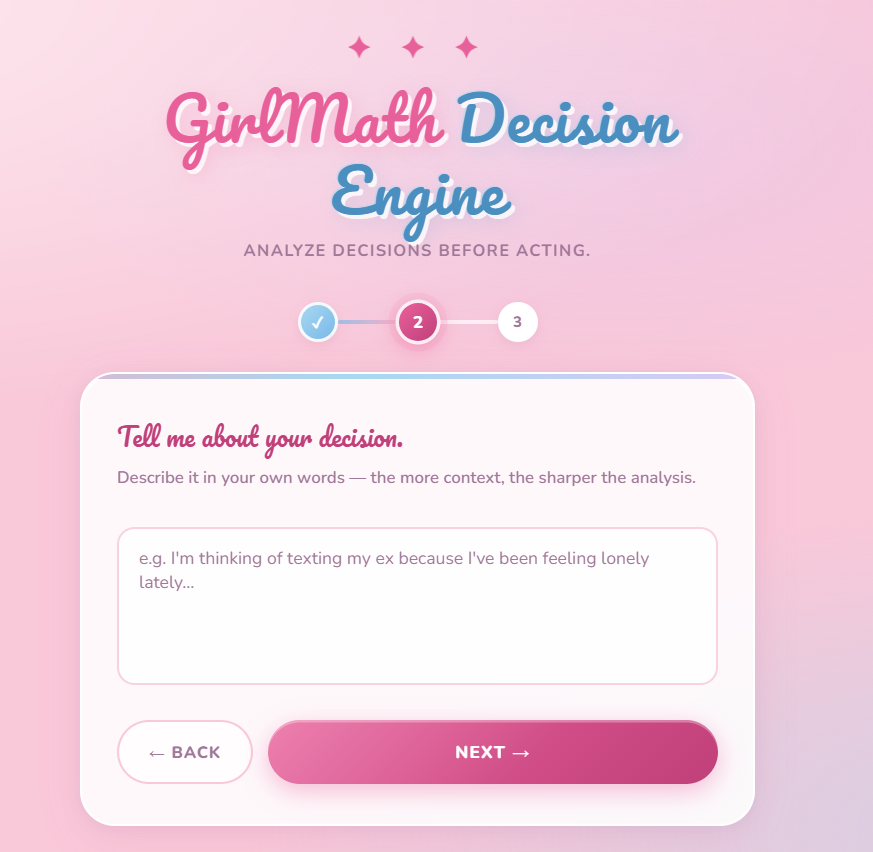
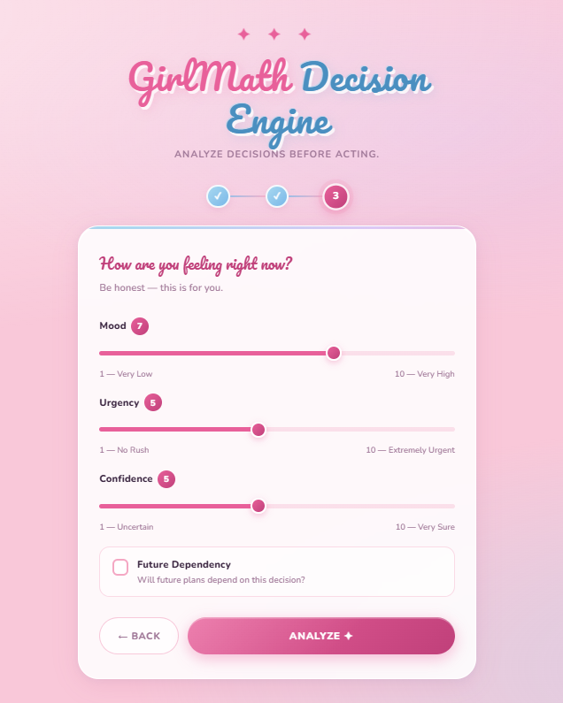
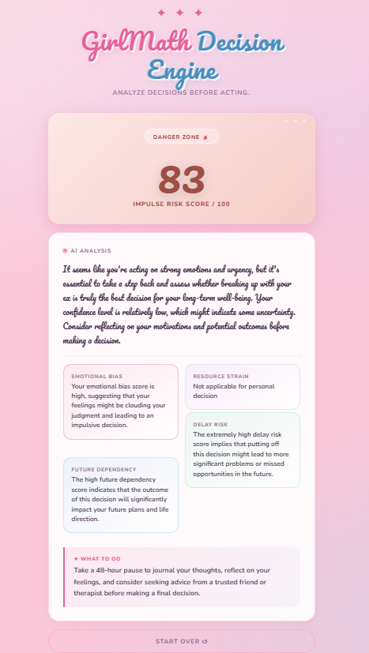
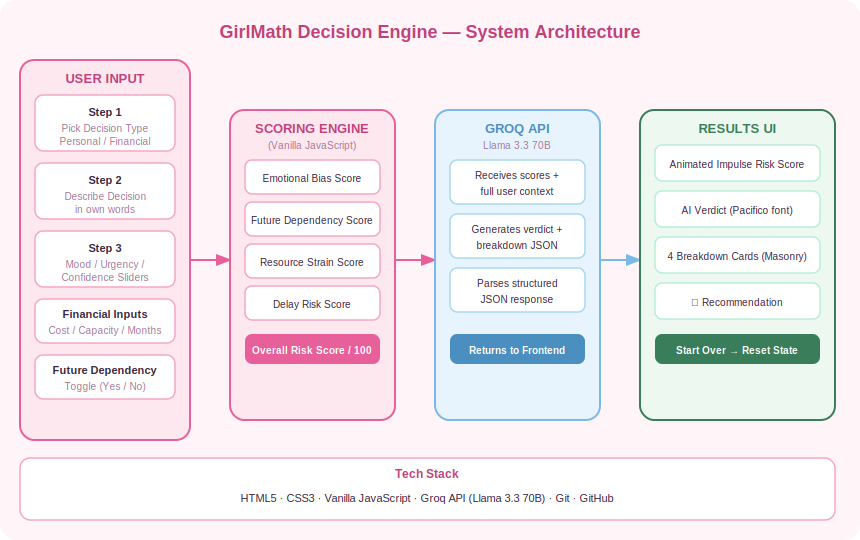
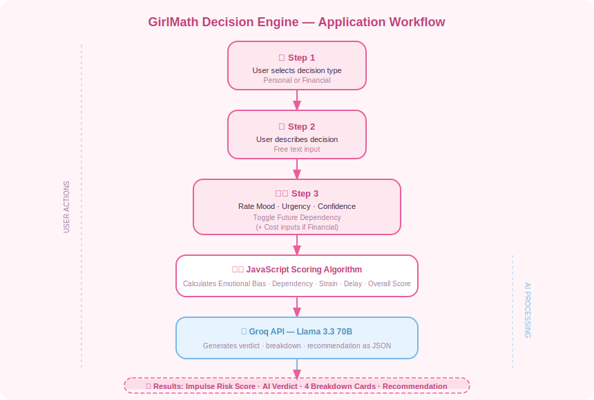

<p align="center">
  
</p>

# GirlMath Decision Engine 

## Basic Details

### Team Name: MATRIX

### Team Members
- Member 1: Manasa Dinkar - SNMIMT,MALIANKARA
- Member 2: Gayathri R Menon - SNMIMT,MALIANKARA

### Hosted Project Link
https://girl-math-engine-git-main-manasa-dinkars-projects.vercel.app/

### Project Description
A pastel-aesthetic web app that helps you think before you act. Describe your decision, rate your mood, urgency & confidence — and get an AI-powered Impulse Risk Score with an honest breakdown and clear recommendation. Works for both personal and financial decisions. 🌸

⚠️ This project was originally built for self-hosting use.
It requires a Groq API key to function.
For security reasons, no API key is included in this repository.
Please generate your own key at https://console.groq.com and insert it in script.js.


### The Problem statement
People often make impulsive decisions driven by emotion — texting an ex, impulse buying, skipping important commitments — without pausing to evaluate the real risks involved.


### The Solution
GirlMath Decision Engine acts as your personal decision analyst. It takes your decision description, emotional state, and contextual inputs, calculates an Impulse Risk Score, and uses AI to give you a warm but honest breakdown with a clear recommendation on what to do.

---

## Technical Details

### Technologies/Components Used

**For Software:**
- Languages used: HTML, CSS, JavaScript
- Frameworks used: None (Vanilla JS)
- Libraries used: Groq API (Llama 3.3 70B)
- Tools used: VS Code, Git, GitHub
---

## Features

List the key features of your project:
- 🌸 Decision Type Selection: Choose between Personal or Financial decision flows
- 📝 Context-First Input: Describe your decision in your own words before rating emotions
- 🎚️ Emotional State Meters: Rate your Mood, Urgency, and Confidence via sliders
- 💸 Financial Analysis Mode: Input cost, monthly capacity, and months until benefit for financial decisions
- 🤖 AI-Powered Analysis: Groq's Llama 3.3 70B generates a personalized verdict and breakdown
---

## Implementation

### For Software:

#### Installation
```bash
[# Clone the repository
git clone https://github.com/MansaDinkar/GirlMath-ENGINE.git

# Navigate into the folder
cd GirlMath-ENGINE]
```

#### Run
```bash
[const CONFIG = {GROQ_KEY: "your_groq_api_key_here"};]
```
---

## Project Documentation

### For Software:

#### Screenshots


Step 1 — Choose between Personal or Financial decision type


Step 2 — Describe your decision in your own words before the analysis begins


Step 3 — Rate your mood, urgency and confidence to calibrate the risk analysis


Step 4 — AI-powered Impulse Risk Score with detailed breakdown and actionable recommendation

#### Diagrams

**System Architecture:**


User input flows through a JavaScript scoring engine, gets sent to Groq's Llama 3.3 70B API with full context, and returns a structured JSON result rendered as an animated risk score, breakdown cards, and recommendation.

**Application Workflow:**
<br><br>

<br><br>
User selects decision type → describes it → rates emotional state → scoring algorithm calculates risk → Groq AI generates analysis → results displayed with score, breakdown and recommendation

---
## AI Tools Used

**Tool Used:** Claude (Anthropic)

**Purpose:** Full-stack development of the GirlMath Decision Engine

- Generated the complete HTML structure and multi-step form flow
- Designed and implemented the full CSS styling including the kawaii pastel aesthetic, animations, and responsive layout
- Built the JavaScript impulse risk scoring algorithm and Groq API integration
- Created slider interactions, step indicator logic, and results rendering

**Key Prompts Used:**
- "Build a GirlMath Decision Engine web app with a multi-step form flow"
- "Add financial vs personal decision modes with conditional input fields"
- "Create an impulse risk scoring algorithm based on mood, urgency, and confidence sliders"
- "Integrate Groq API with Llama 3.3 70B to generate personalized AI analysis from scoring data"
- "Style the app with a kawaii pastel aesthetic using Pacifico and Nunito fonts"

**Percentage of AI-generated code:** ~90%

**Human Contributions:**
- Concept and product idea (GirlMath theme and angle)
- Decision to use Groq/Llama as the AI backend for fast, free inference
- UI/UX direction — color palette, tone, fonts, and overall aesthetic vision
- Prompt engineering for the AI analysis persona ("sharp, honest, warm analyst")

---

## Team Contributions
- Gaythri R Menon: UI/UX design — visual aesthetic, color palette, layout, and overall look and feel.
- Manasa Dinkar: Frontend development, API integration, scoring algorithm, testing, and documentation.
---
## License

This project is licensed under the MIT License - see the (LICENSE) file for details.

Made with ❤️ at TinkerHub
